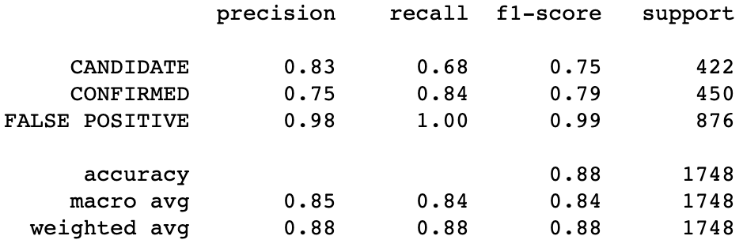
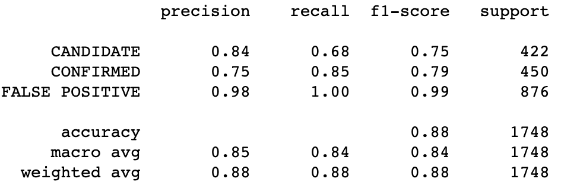

# Machine-Learning-Challenge

#### This challenge explores different machine learning models capable of classifying candidate exoplanets from the raw dataset.
Over a period of nine years in deep space, the NASA Kepler space telescope has been out on a planet-hunting mission to discover hidden planets outside of our solar system.

### Preprocess the Data

* Preprocess the dataset prior to fitting the model.
* Perform feature selection and remove unnecessary features.
* Use `MinMaxScaler` to scale the numerical data.
* Separate the data into training and testing data.

### Which model best fits the data?

Classification report of this model also has the best precision of outcomes (.80 for "CONFIRMED").

### Comparison

* The following sections show the overall scores for outcomes for all models.

Logistic Model

Random Forest Classifer Model

Support vector machine classifier Model

K-nearest neighbors classifier Model

